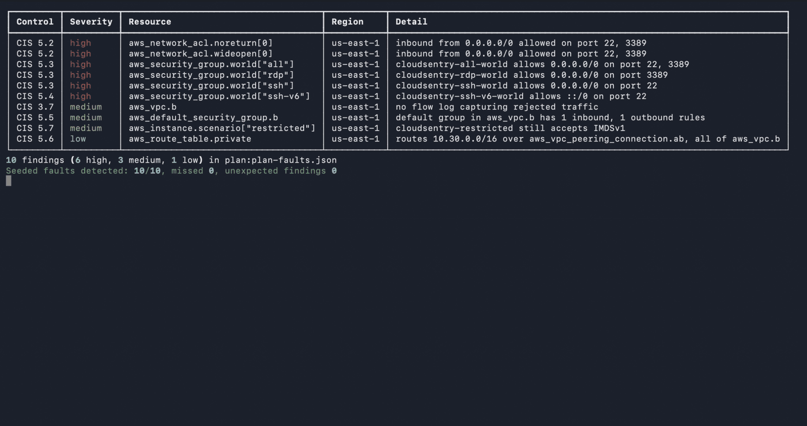
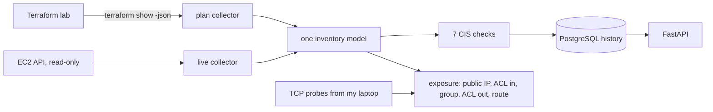

# CloudSentry

Audits AWS VPC network security against seven CIS AWS Foundations controls, on live accounts and on Terraform plans before anything is created, and checks which instance SSH and RDP ports an internet address can actually reach.

**Result:** on a test lab with 10 seeded misconfigurations, caught 10/10 at Terraform plan time with 0 false positives, and cut false-positive exposure alerts from 4 to 0 by following the whole network path, checked against live TCP connections.

**Stack:** Python, boto3, Terraform, AWS (VPC, EC2, IAM, S3), PostgreSQL, FastAPI, Docker, GitHub Actions, pytest

[](https://github.com/mumer-net/cloudsentry/actions/workflows/ci.yml)



## Why I built this

I interned at Cisco and now work on my college's IT team, mostly on network access and security, so I spend a lot of time thinking about why traffic does or doesn't get through. In AWS, whether a port can be reached depends on security groups, network ACLs, route tables, and public IPs together, so a port that looks open in one place can be closed in another. I built a lab where I know the right answer for every case and checked my tool against real connections.

## Results

| What | Security group only (before) | Full path (after) | How it's measured |
| --- | --- | --- | --- |
| Instance ports flagged as exposed | 8 | 4 | `cloudsentry exposure --probe` on the faulty lab, 3 runs |
| Confirmed by a live TCP probe | 4 | 4 | Probes from my laptop to each public IP |
| False positives | 4 | 0 | Flagged, but not reachable |
| Missed exposures | 0 | 0 | Not flagged, but the probe connected |

All three runs gave the same numbers.

| Check | Result | How it's measured |
| --- | --- | --- |
| Seeded CIS faults caught at plan time | 10/10, 0 unexpected | CI plans the lab with no AWS credentials, then `cloudsentry scan --plan --expect` |
| Seeded CIS faults caught in my AWS account | 10/10, 0 unexpected | `cloudsentry scan --expect` on the applied lab |
| Clean lab | 0 findings | Same scan with `faults = false` |

Raw results are in [results/](results/).

## How it works



| CIS AWS Foundations v5.0.0 | What fails | AWS Security Hub control |
| --- | --- | --- |
| 5.2 | A network ACL allows 0.0.0.0/0 to port 22 or 3389 | EC2.21 |
| 5.3 | A security group allows 0.0.0.0/0 to port 22 or 3389 | EC2.53 |
| 5.4 | A security group allows ::/0 to port 22 or 3389 | EC2.54 |
| 5.5 | A default security group has any rules | EC2.2 |
| 5.6 | A peering route sends the whole peer VPC range | None; CIS lists it as a manual check |
| 5.7 | An instance still accepts IMDSv1 | EC2.8 |
| 3.7 | A VPC has no flow log that captures rejected traffic | EC2.6 |

The exposure check follows a connection from my address to an instance port in the order AWS applies things: the instance needs a public IP, the subnet's network ACL has to let the packet in, a security group has to allow it, the network ACL has to let the reply out to the client's port, and the subnet's route table has to send the reply to an internet gateway. It reports the first thing that blocks the connection.

The lab has one instance for each case:

| Instance | Designed to be blocked by |
| --- | --- |
| open-ssh, open-rdp, all-open | Nothing on their open ports |
| nacl-deny | A network ACL rule that denies 22 and 3389 before an allow-all rule |
| nacl-noreturn | A network ACL that only lets HTTPS out, so replies never leave |
| no-route | A route table with no internet gateway route |
| private | No public IP |
| restricted | A security group that only allows one outside address |

A few design choices:

- The scanner only reads. Its IAM policy ([docs/scanner-policy.json](docs/scanner-policy.json)) allows nine `ec2:Describe*` actions and nothing else, and it signs in with `aws login`, so there are no long-lived access keys.
- Plan mode and live mode fill the same model, so the checks are written once. A plan never shows the default security group and network ACL that AWS gives every new VPC, so plan mode adds them with AWS's default rules. Otherwise a plan would look cleaner than the account it creates.
- Network ACL rules are checked in rule-number order and the first match wins, so a deny for port 22 at rule 90 makes a later allow-all harmless for that port.
- The clean lab's network ACL lets return traffic in on 1024-3388 and 3390-65535. The usual single 1024-65535 rule includes 3389, which fails CIS 5.2.
- Before probing, the tool connects to portquiz.net on 22 and 3389. If my network blocks those ports on the way out, every probe would fail and the results would look better than they are.
- Probe results are saved without IP addresses.

## How to run

The AWS steps need two profiles, both signed in with `aws login`: an admin one that Terraform reads from `AWS_PROFILE`, and a read-only one (`cloudsentry-ro` below) with the policy in [docs/scanner-policy.json](docs/scanner-policy.json).

```bash
git clone https://github.com/mumer-net/cloudsentry && cd cloudsentry
uv sync
make test                                                                   # lint, then 45 pass and 7 skip without a database
uv run cloudsentry scan --plan tests/fixtures/plan-faults.json --expect     # plan-time check, no AWS needed
cp .env.example .env                                                        # then set POSTGRES_PASSWORD
docker compose up -d --wait && set -a && source .env && set +a              # history database, API on :8000
cd lab && terraform init && cd .. && make faulty-lab                        # the faulty lab, admin profile
uv run cloudsentry scan --tag Project=cloudsentry --profile cloudsentry-ro  # read-only, saved to history
uv run cloudsentry exposure --tag Project=cloudsentry --profile cloudsentry-ro --probe
uv run cloudsentry history
make destroy
```

## Method

- Plan-time detection: CI runs `terraform plan` on both lab modes with fake credentials and `offline = true`, so nothing reaches AWS, then scans the JSON plan. Every resource the faulty lab breaks on purpose carries a `Fault` tag naming the control, and `--expect` compares the findings with those tags, so a missed fault or an extra finding fails the build.
- Live detection: the same scan against the applied lab in my account, once with `faults = false` and once with `faults = true`.
- Exposure: with the faulty lab applied, `cloudsentry exposure --probe` evaluates 16 instance ports (8 instances, ports 22 and 3389) from my public address, then tries a TCP connection from my laptop to each of the 14 on an instance with a public IP. The private instance has none, so nothing on the internet can reach it. Every instance runs a listener on both ports, so a failed connection means the network blocked it. The before counts a port as exposed when an attached security group allows 0.0.0.0/0 on it. The after follows the whole path. I ran it 3 times, 2 minutes apart.

## Tests

52 pytest tests run in GitHub Actions on every push, 7 of them against a real PostgreSQL service container. They cover the seven checks (including rule order and the 3389 range), the live collector against moto's fake EC2 API, the plan collector against real `terraform show -json` output of the lab, the exposure path for every lab case, TCP probes, scan history, the API, and the CLI. A second CI job plans the lab and fails if any seeded fault is missed, and a third builds the Docker image and starts the API with Docker Compose.

## What I'd do next

- Follow IPv6 paths in the exposure check. Right now it only evaluates IPv4 sources.
- Handle security group rules that reference other groups or prefix lists, and paths through NAT gateways and transit gateways.
- Scan every account in an AWS Organization by assuming a read-only role in each one.
- Compare the exposure results with VPC Reachability Analyzer and Network Access Analyzer, which analyze paths for resources that already exist.

## Build notes

- Goal: check which cloud network misconfigurations actually expose something, and prove it with real connections.
- Built in three releases: v0.1 (the Terraform lab, seven CIS checks, plan-time checks in CI), v0.2 (the exposure check and probes), v0.3 (scan history in PostgreSQL, the API, Docker).
- My first scan of a brand-new AWS account found 51 findings in the default VPCs of 17 regions, before I had built anything.
- I fixed an IMDSv1 finding by hand in the EC2 console. The next scan and the history API both reported it as fixed, but `terraform plan` wanted to change it back. A console fix only lasts if the code changes too.
- Bug: CI's Docker job failed with curl exit code 56. `docker compose up --wait` counted the API as ready before uvicorn was listening, because the API had no healthcheck. I added one that calls `/health`, so `--wait` now waits for a real answer.
- Gotcha: when I signed in the read-only CLI profile with `aws login`, the browser reused my admin session and offered to bind the read-only profile to the admin user. I declined, signed in again in a private window, and checked each profile with `aws sts get-caller-identity`.
- My drill notes are in [docs/drills.md](docs/drills.md).

## License

MIT
